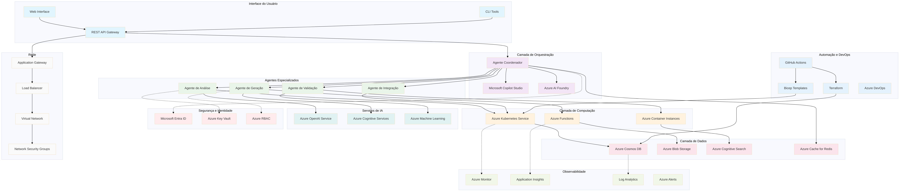

# 🤖 Aplicações Inteligentes com Azure: Agentes Autônomos e Copilots em Ação

> **Laboratório Técnico Avançado** para demonstração prática de aplicações inteligentes utilizando IA generativa e orquestração de multiagentes com tecnologias Microsoft Azure.

[](https://azure.microsoft.com/en-us/products/ai-foundry)
[](https://copilotstudio.microsoft.com/)
[](https://github.com/features/actions)
[](https://azure.microsoft.com/en-us/products/functions)

## 🎯 **Visão Geral da Apresentação**

Este laboratório demonstra na prática como as **inovações mais recentes da Microsoft** em IA generativa e orquestração de multiagentes estão revolucionando o desenvolvimento de aplicações inteligentes.

### **🚀 O que você verá em ação:**
- **Agentes Autônomos** coordenados com Azure AI Foundry
- **Experiências Personalizadas** com Microsoft Copilot Studio  
- **Arquiteturas Modernas** usando Azure Functions, Cosmos DB e AKS
- **Segurança Avançada** com identidade de agentes via Entra ID
- **Web Agentic** - O futuro das aplicações inteligentes

---

## 🏗️ **Arquitetura da Solução**



### **Componentes Principais:**
- 🧠 **Azure AI Foundry**: Orquestração de modelos LLM
- 🤖 **Agentes Especializados**: Análise, Geração, Validação
- 🌐 **Copilot Studio**: Interface conversacional inteligente
- ⚡ **Azure Functions**: Processamento serverless escalável
- 🗄️ **Cosmos DB**: Persistência global distribuída
- 🐳 **AKS**: Orquestração de containers
- 🔐 **Entra ID**: Identidade e segurança avançada

---

## 🎪 **Demonstrações Práticas**

### **Demo 1: Orquestração de Agentes Inteligentes**
```bash
# Executar coordenador de agentes
cd src/agents/coordinator
python main.py --task="analyze_market_trends" --agents=3
```

**O que acontece:**
1. 🎯 **Coordinator Agent** recebe a tarefa e planeja a execução
2. 📊 **Analysis Agent** processa dados de mercado em tempo real
3. 🎨 **Generation Agent** cria insights e visualizações
4. ✅ **Validation Agent** verifica qualidade e precisão dos resultados

### **Demo 2: Integração com Copilot Studio**
```bash
# Iniciar interface personalizada
cd src/copilot-studio
node main.js --environment=demo --features=advanced
```

**Recursos demonstrados:**
- Interface conversacional inteligente
- Personalização de experiências por usuário
- Integração seamless com agentes backend
- Respostas contextuais e adaptativas

### **Demo 3: Arquitetura Serverless Escalável**
```bash
# Deploy da arquitetura completa
./scripts/deploy/deploy-to-azure.sh --environment=demo --scale=auto
```

**Componentes ativados:**
- Azure Functions para processamento distribuído
- Cosmos DB para persistência global
- AKS para orquestração de containers
- Azure Monitor para observabilidade total

---

## 🔐 **Segurança e Identidade Avançada**

### **Identidade de Agentes com Entra ID**
```json
{
  "agent_identity": {
    "principal_id": "coordinator-agent-001",
    "roles": ["AI.Agent.Coordinator", "Data.Analyst"],
    "scopes": ["https://graph.microsoft.com/.default"],
    "authentication": "managed_identity"
  }
}
```

### **Controle de Acesso Granular**
- 🔑 **Managed Identity** para cada agente
- 🛡️ **RBAC** com permissões específicas por função
- 🔐 **Key Vault** para secrets e certificados
- 📝 **Audit Logs** para compliance total

---

## 🚀 **Execução Rápida para Demonstração**

### **1. Setup Instantâneo (< 5 minutos)**
```bash
# Clone e configure
git clone https://github.com/ricardo2009/ai-multiagent-lab.git
cd ai-multiagent-lab
./scripts/setup/setup-local.sh --demo-mode
```

### **2. Deploy Automático na Azure**
```bash
# Provisiona toda infraestrutura
./scripts/deploy/deploy-to-azure.sh --quick-demo
```

### **3. Teste dos Agentes**
```bash
# Executa cenário de demonstração
python src/tests/demo_scenario.py --interactive
```

---

## 📊 **Métricas e Observabilidade em Tempo Real**

### **Dashboard Executivo**
- 📈 **Performance dos Agentes**: Latência, throughput, taxa de sucesso
- 🎯 **Qualidade das Respostas**: Precisão, relevância, satisfação
- 💰 **Custos Operacionais**: Consumo de tokens, recursos Azure
- 🔒 **Segurança**: Tentativas de acesso, anomalias detectadas

### **Consultas KQL Prontas**
```kql
// Performance dos agentes em tempo real
AgentMetrics
| where TimeGenerated > ago(1h)
| summarize 
    AvgLatency = avg(ResponseTime),
    TotalRequests = count(),
    SuccessRate = countif(Status == "Success") * 100.0 / count()
    by AgentType, bin(TimeGenerated, 5m)
| render timechart
```

---

## 🎯 **Cenários de Demonstração**

### **Cenário 1: Análise Inteligente de Documentos**
**Objetivo**: Demonstrar processamento multimodal e extração de insights

**Fluxo**:
1. Upload de documento via Copilot Studio
2. Analysis Agent extrai texto, imagens e metadados
3. Generation Agent cria resumo executivo
4. Validation Agent verifica precisão e compliance

### **Cenário 2: Assistente de Decisão Empresarial**
**Objetivo**: Mostrar tomada de decisão colaborativa entre agentes

**Fluxo**:
1. Pergunta estratégica via interface
2. Coordinator Agent distribui análise por domínios
3. Agentes especialistas processam dados específicos
4. Síntese final com recomendações acionáveis

### **Cenário 3: Automação de Processos Complexos**
**Objetivo**: Demonstrar orquestração de workflows empresariais

**Fluxo**:
1. Trigger automático via Azure Functions
2. Agentes processam etapas em paralelo
3. Validação e aprovação automática
4. Notificação e logging completo

---

## 🔧 **Tecnologias e Ferramentas**

### **Stack Principal**
- 🧠 **Azure AI Foundry**: Orquestração de modelos LLM
- 🤖 **Microsoft Copilot Studio**: Interface conversacional
- ⚡ **Azure Functions**: Processamento serverless
- 🗄️ **Cosmos DB**: Banco de dados global
- 🐳 **Azure Kubernetes Service**: Orquestração de containers
- 🔐 **Entra ID**: Identidade e acesso

### **DevOps e Automação**
- 🔄 **GitHub Actions**: CI/CD com matriz avançada
- 📊 **Azure Monitor**: Observabilidade completa
- 🛡️ **Azure Security Center**: Proteção avançada
- 📈 **Application Insights**: Telemetria detalhada

---

## 🎪 **Highlights da Apresentação**

### **🚀 Inovações Demonstradas**
- **Web Agentic**: Nova paradigma de aplicações inteligentes
- **Multi-Agent Orchestration**: Coordenação inteligente de agentes
- **Adaptive Personalization**: Experiências que evoluem com o usuário
- **Zero-Trust Security**: Segurança nativa para agentes IA

### **💡 Insights Técnicos**
- Padrões de design para aplicações agentic
- Estratégias de escalabilidade para IA empresarial
- Melhores práticas de segurança para agentes autônomos
- Métricas e KPIs para sistemas de IA

### **🔮 Visão de Futuro**
- Evolução das interfaces conversacionais
- Agentes especializados por domínio
- Ecosistemas de IA colaborativa
- Impacto na experiência do usuário

---

## 📞 **Suporte e Recursos**

### **Durante a Apresentação**
- 🔗 **Repositório**: [github.com/ricardo2009/ai-multiagent-lab](https://github.com/ricardo2009/ai-multiagent-lab)
- 📊 **Dashboard**: Métricas em tempo real
- 🎥 **Demos**: Cenários interativos
- 📋 **Documentação**: Guias técnicos detalhados

### **Pós-Apresentação**
- 📚 **Documentação Técnica**: Implementação completa
- 🛠️ **Scripts de Deploy**: Automação total
- 🧪 **Testes**: Validação de funcionalidades
- 📈 **Monitoramento**: Observabilidade operacional

---

## 🏆 **Resultados Esperados**

Ao final desta demonstração, você terá visto na prática:

✅ **Como criar** agentes autônomos escaláveis com Azure AI Foundry  
✅ **Como personalizar** experiências com Microsoft Copilot Studio  
✅ **Como integrar** em arquiteturas modernas e seguras  
✅ **Como implementar** segurança avançada com Entra ID  
✅ **Como preparar-se** para o futuro da Web Agentic  

**Este laboratório representa o estado da arte em aplicações inteligentes empresariais, pronto para implementação em produção.**

---

*Desenvolvido para arquitetos, desenvolvedores e líderes técnicos que desejam aplicar IA de forma escalável, segura e alinhada com as tendências mais avançadas do mercado.*

